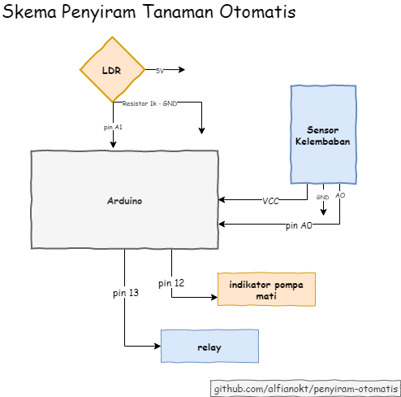

# Penyiram Otomatis
> Penyiram tanaman otomatis dengan arduino 🌿🚿

## Skema
> Skema arduino dan komponen pendukung

## Kode
Sumber kode utama terletak di `arduino/code.ino`

## Tentang
> Projek ini dibuat oleh saya dan teman-teman di SMKN 3 Jepara dengan tujuan praktek karya ilmiah.
Jika anda ingin bergabung silahkan kontak saya 🙂